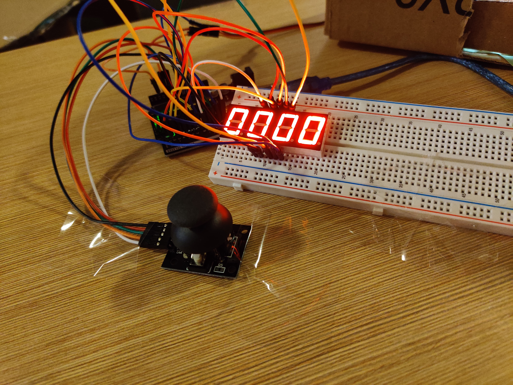
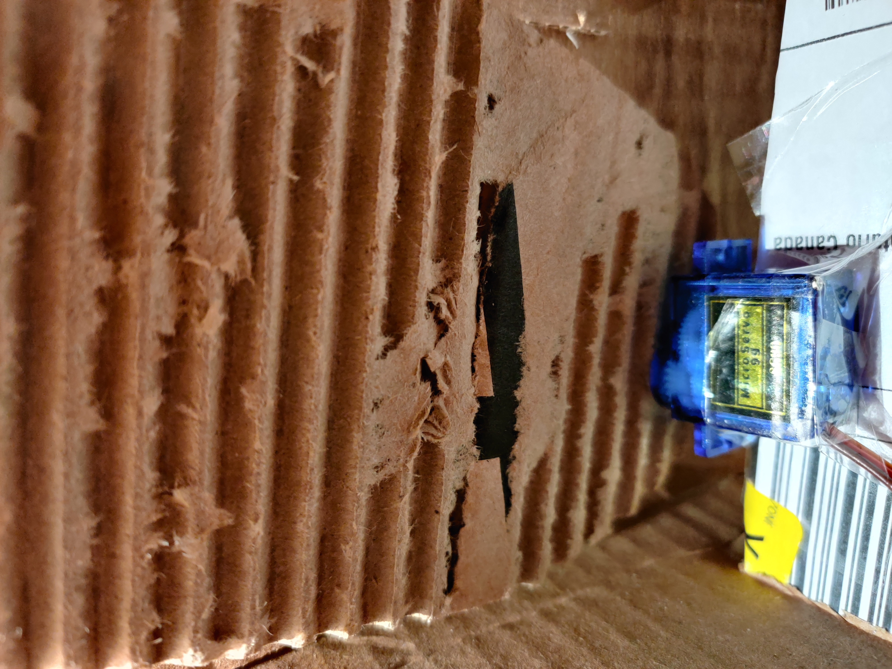

# Safe Safe
A joystick-controlled, PIN-protected safe for Arduino Uno R3.

## Description
Input provided from a joystick is used to control the seven-seg PIN display and open or close the safe door:
- Moving back and forth in the X-direction moves the focus between digits
- Rocking up and down in the Y-direction controls digit incrementation. 
- When the safe is locked, pressing down on the joystick registers as a request to enter the PIN and open the door. 
- When the safe is unlocked, pressing down again will close the door. 

#### Successful PIN Entry

#### Incorrect PIN Entry

## Setup

## Credits:

- David Hu: Seven-segment display control functions
- Serena He: Main loop sequence logic
- Rumi Aneke: Servo motor actuation, circuit schematic and wiring
